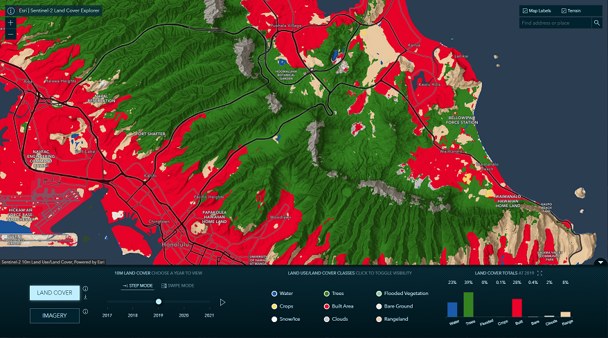

# Sentinel-2 Land Cover Explorer

Land use land cover (LULC) maps are an increasingly important tool for decision-makers in many industry sectors and developing nations around the world. The information provided by these maps helps inform policy and land management decisions by better understanding and quantifying the impacts of earth processes and human activity.

This app provides dynamic visual and statistical change by comparing annual slices of the Sentinel-2 10m Land Use/Land Cover data as you explore the map.

[view it live](https://livingatlas.arcgis.com/landcoverexplorer)



## Features

- Visual change analysis with either ‘Step Mode’ or ‘Swipe Mode’
- Dynamic statistical change analysis by year, map extent, and class
- Filter by selected land cover class
- Regional class statistics summarized by administrative boundaries
- Imagery mode for visualization and comparison of the source imagery
- Select and dynamically change imagery renderings
- Data download for offline use

## Getting Started

1. Make sure you have a fresh version of [Node.js](https://nodejs.org/en/) and NPM installed. The current Long Term Support (LTS) release is an ideal starting point

2. Clone this repository to your computer: 
    ```sh
    git clone https://github.com/vannizhang/land-cover-explorer.git
    ```


3. From the project's root directory, install the required packages (dependencies):

    ```sh
    npm install
    ```

4. To run and test the app on your local machine (http://localhost:8080):

    ```sh
    # it will start a server instance and begin listening for connections from localhost on port 8080
    npm run start
    ```

5. To build/deploye the app, you can run:

    ```sh
    # it will place all files needed for deployment into the /dist directory 
    npm run build
    ```

## Resources
- [Sentinel-2 10m Land Use/Land Cover Time Series](https://www.arcgis.com/home/item.html?id=cfcb7609de5f478eb7666240902d4d3d)
- [Sentinel-2 Level-2A](https://www.arcgis.com/home/item.html?id=255af1ceee844d6da8ef8440c8f90d00)

## Issues
Find a bug or want to request a new feature? Please let me know by submitting an issue.

## Licensing
Copyright 2022 Esri

Licensed under the Apache License, Version 2.0 (the "License");
you may not use this file except in compliance with the License.
You may obtain a copy of the License at

   http://www.apache.org/licenses/LICENSE-2.0

Unless required by applicable law or agreed to in writing, software
distributed under the License is distributed on an "AS IS" BASIS,
WITHOUT WARRANTIES OR CONDITIONS OF ANY KIND, either express or implied.
See the License for the specific language governing permissions and
limitations under the License.